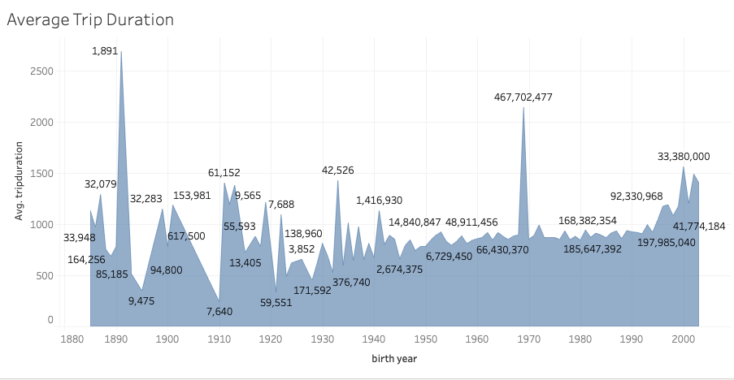

# Bikesharing

The following analysis integrates data from the https://www.citibikenyc.com/system-data
With the help of pandas some data was arranged and presented in different format.

The information was downloaded in a CSV file (not attached due to the file size and GH restrictions), containing number of rides, id's of every bike, gender, picking and dropping points, dates, riding times, among others.

-----------------------------------

## The analysis

By using Tableau we were able to graphically identify the picking points and also identify the most crowded or preferred by the users. This will help us to allocate more units on those points and plan an expansion of the facilities or promotions.

This graph was the result of crossing the birth year and the average trip duration, so we can also identify potential risks and hire different insurance policies.

This one as a result of trip duration and bike id, and can help us to identify how many bikes need to be under maintenance or replacement.

With all the information a Dashboard was also created, so in a single view we can explore many KPI's or Worksheets:

-----------------------------------

## The public links to interact with the information 

For more details please get into the dashboard or the story:

[link to dashboard](https://public.tableau.com/app/profile/gabo.renovation/viz/bike-sharingprogramDashboard/Dashboard1?publish=yes)

[link to story](https://public.tableau.com/app/profile/gabo.renovation/viz/bike-sharingprogramStory/Story1?publish=yes)

-----------------------------------
